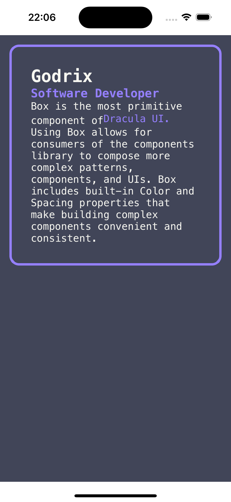

# 🚧[WIP] Dracula UI for React Native🚧

> A dark-first collection of UI patterns and components.


## :thinking: Why

Most templates are built using light colors and later on adapted to dark colors. Dark themes shouldn't be an afterthought, they should be a top priority.

Our mission is to unleash the creative potential in every developer. We do that by providing modular components that can be used to build modern apps faster.

## :book: Documentation

🚧 Work in progress 🚧

|            Example        |
| :---------------------------:
|  |
## :package: Install

You can install Dracula UI for react native via npm or yarn.

```bash
npm install react-native-dracula-ui

yarn add react-native-dracula-ui
```

## :sparkles: Using with React

You can also use Dracula UI with React by importing the JS package.

```js
import { Box, Text, Heading, Anchor } from 'react-native-dracula-ui';

function App() {
  return <Heading size="2xs" color="purple">Software Developer</Heading>
}

export default App;
```
### :pencil2: License

react-native-dracula-ui is [MIT licensed](https://github.com/godrix/react-native-dracula-ui/tree/main/LICENSE) and built with ❤️ in 🇧🇷 by [Godrix](https://www.linkedin.com/in/carlosgodri/)
